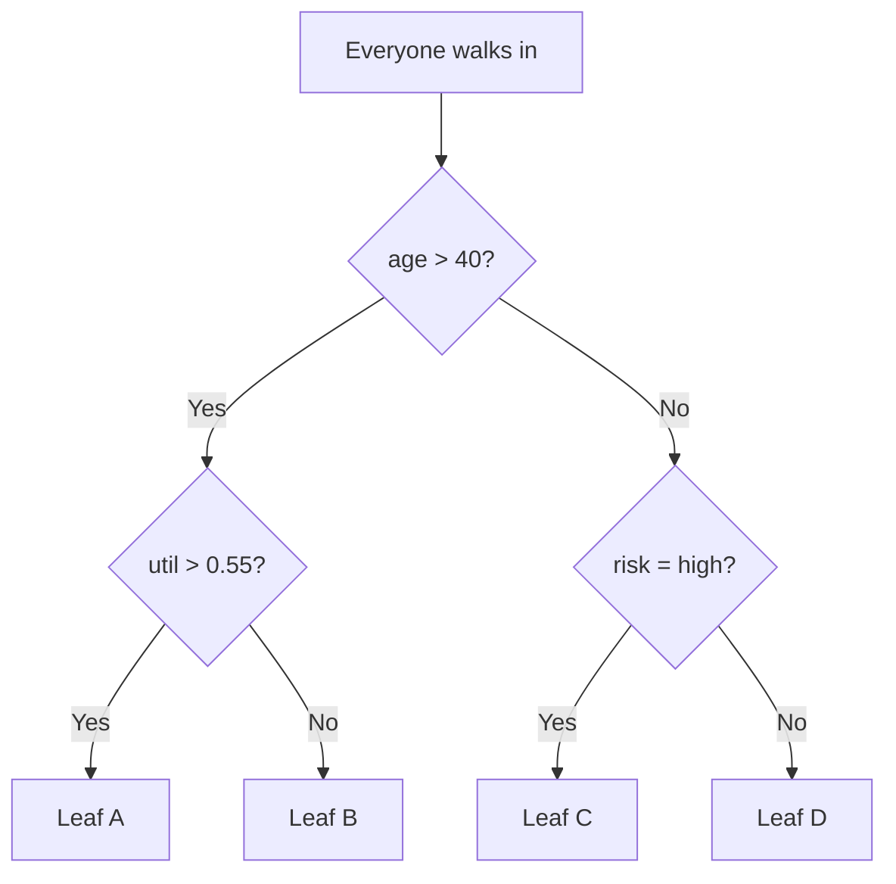
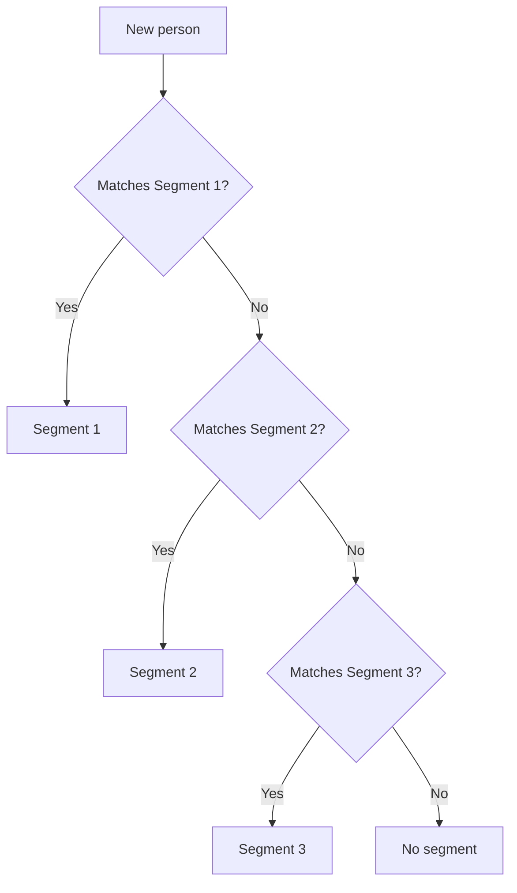

## Q&A

### 🔴 Strategy & concepts

**Q1. Why sequential greedy + residual removal instead of a globally optimal segment set?**
Finding the globally optimal set of non-overlapping rules is combinatorially infeasible
(tens of thousands of candidate rules per iteration). Instead each iteration picks one
champion on the current residual (`extract_segments`, `builder.py:1375`), then claims its
rows via the `__rs_excluded` flag (`1771–1777`) so later segments only see leftovers.
What we sacrifice: order dependence — the first segment owns its rows, and overlapping
high-lift rules are lost. What we buy: mutual exclusivity by construction, guaranteed
termination (the residual only shrinks), and an interpretable ordered rule list
("check segment 1 first, then 2, …"). Final counts are recomputed hierarchically on the
original data so reported KPIs exactly match assignment (`evaluate_final_coverage`).

**Q2. Why pick champions on a binned approximation and then re-validate with raw SQL?**
The binned view (`binned_df`) makes search fast: one `GROUP BY` per feature-combo,
batched into chunks of 100 `UNION ALL` queries (`933–949`). But binning is lossy —
bin labels can misalign with row ids (see the real bug documented at `479–492`, where
transforming sorted arrays produced spurious candidates). So the champion is re-run as
raw SQL against the real residual (`1579–1587`) and only accepted if actual
count/events/lift clear the floors. Search is fast *and* the accepted numbers are ground
truth, not approximation artefacts.

**Q3. Why is lift enforced at acceptance but never used for pruning?**
Because lift is **not anti-monotone**: adding a condition can *raise* the event rate, so
a 3-way rule can carry higher lift than any pair it was grown from. Pruning on lift
would silently discard exactly those interaction effects. Rows and events, by contrast,
never grow when a rule narrows — so candidate growth is gated on volume only
(`HAVING count/events`, `901–902`; pair validity, `1525`). `min_lift` is applied only
afterwards, at the grid shortlist (`1546`) and the final raw validation (`1587`).

**Q4. Why is lift always scored against the ORIGINAL base rate, even in later iterations?**
`original_base_rate` is locked once (`1369–1373`) so every segment's lift means the same
thing: "how many times the overall population rate". If we re-based each iteration, the
denominator would shrink as events are claimed and late segments would look artificially
strong — and segments would no longer be comparable. The residual's current base rate is
still logged per iteration (`diagnostics_["base_rate"]`) for context, and final coverage
is recomputed hierarchically on the original data.

**Q5. Why top-1 per grid config instead of pooling all candidates?**
Each `(min_sample_size, min_lift)` grid point is a different strictness trade-off, and
its champion preserves that point of view (a strict config's small sharp rule vs a loose
config's broad rule). Champions are re-sorted (`1565`) and validated **sequentially with
backtracking** (`1576–1594`): the first to pass raw validation wins; failures are skipped
(first failure recorded as `closest_miss`) and the scan continues. So a strict champion
failing raw validation does NOT kill the iteration — weaker candidates still get tried.

**Q6. What makes runs deterministic — and what isn't?**
Three mechanisms: (1) rows are lex-sorted by (value, target) before CART fitting so
OptBinning sees identical input order, while transform stays on original order
(`493–508`); (2) feature ranking sorts by `(-metric, variable)` so IV ties break
alphabetically (`559–564`); (3) every sort key ends with the rule string so candidate
ties resolve identically despite unordered SQL `GROUP BY` and hash randomization
(`318–324`). Residual risks: parallel float-summation order in DuckDB aggregates
(negligible), and library-version drift (optbinning/DuckDB). File names contain UUIDs,
but that's cosmetic.

**Q7. How do you stop degenerate tail segments, and how do reported counts stay honest?**
Five guards stop the loop: residual too small or base rate zero (`1389–1397`); features
exhausted (`1451–1454`); no binned variation (`1475–1478`); nothing clears the grid
(`1556–1563`); everything fails raw validation (`1612–1618`). Reported numbers stay
honest because `evaluate_final_coverage` (`1803–1889`) replays the segments on the
original data with a priority `CASE WHEN` (`1838–1847`) — first matching segment wins —
plus cumulative capture columns that expose diminishing returns.

**Q8. What does `max_feature_reuse=1` (default) + `enable_diversity` buy, and cost?**
It stops one dominant feature from owning every segment: each winning rule increments
per-feature usage (`1631–1638`), features at the cap are excluded (`1419`, `1448`), and
`enable_diversity` additionally blocks same-group combos via `is_diverse` (`270–277`,
checked at `1521`/`1533`). The cost: later segments draw from weaker features and the
run can stop early with "features exhausted". Diversity of explanation is traded
against raw segment strength — raise the cap when coverage matters more than variety.

### 🟡 Technical

**Q9. Why doesn't a lift-failing 2-way block its 3-way child?**
Pair validity is tracked per *variable pair* (`frozenset`, `1525`): a pair is valid if
**any** of its bin-combos clears the volume floors. A 2-way that misses lift still
counts as a valid pair. The Level-3 gate (`1530–1533`) requires all three sub-pairs of a
triplet to be valid — so one bad pair kills only triplets containing it, never the
whole layer.

**Q10. What are the adjacent-expansion acceptance rules, and why?**
A merged window must clear lift, events, count (`790–793`) **and** strictly exceed the
seed's events (`exp_events > base_events`, `794`) — otherwise expansion would relabel
the same coverage instead of growing it. `_candidate_windows` (`838–851`) refuses
full-domain merges because a window spanning all bins removes the variable's filtering
power entirely, producing degenerate duplicates across variables. (Naive path only.)

**Q11. Why does the grid shortlist check count + lift, but raw validation checks all three?**
Generation already floors events in SQL (`HAVING … >= min_events`, `901–902`), so the
binned pool is events-clean — count + lift suffices to pick each config's top-1
(`1546`). Raw validation (`1587`) re-checks all three because the binned approximation
can lie (misalignment, NULL handling, merged-label parsing). A shortlist pass that
fails events on raw is rejected, the gap recorded, and the scan moves on.

**Q12. How does `parse_rule_to_sql` tell merged ranges, merged categories, and `[VIP]` apart?**
Numeric merges require the `"),["` separator (`1056–1060`) — categorical merges join
with `"],"`, so they can't misfire. Categorical merges (`1113–1130`) extract inner
`[…]` tokens, with a guard so a single nested pair like `[[VIP]]` is treated as one
literal (`1117–1124`). Plain categoricals are detected via quotes/keywords, non-`(`/`[`
starts, >2 tokens, or non-numeric tokens (`1143–1152`). Getting this wrong emits the
wrong predicate (range vs `IN` list) → raw validation counts the wrong rows → false
accept/reject of the champion.

**Q13. Where do NULLs go?**
Naive numeric NULLs → `'Missing'` bin (`396–402`); null-like categoricals → `'Missing'`
(`404–409`); `Missing` bins are skipped in expansion (`733`) and map to `IS NULL` in SQL
(`1183–1185`). Residual exclusion uses `WHERE (sql) IS TRUE` (`1771–1777`), so rows
evaluating to NULL are never claimed — they stay in the residual. NULLs are never
silently assigned to a segment.

**Q14. How do I choose `sort_priority`, and is the silent fallback a footgun?**
14 variants (`279–324`) choose which dimension leads: rate-first (default
`rate_lift_count`: precise strong rules), lift-first (peak strength), count/events-first
(broad coverage, e.g. `lift_events_rate` for capture tuning). Yes, the fallback is a
footgun: an unknown string silently maps to `(lift, rate, count)` (`316–317`) with no
error — unlike `binning_method`, which raises `ValueError` (`181–185`). Double-check
spelling; a typo quietly changes selection.

**Q15. Why is `max_rr` volume-floored but IV computed over all bins?**
`max_rr` (`443–446`) ranks *achievable rules* — a 3-row bin at 100% must not top the
ranking. IV (`448–451`) is a distribution-shift statistic that needs complete
event/non-event denominators; flooring it would distort the totals and the log-ratio
math. (The optimal path mirrors this: `valid_bins` for `max_rr` at `526–530`, full
table IV at `524`.)

**Q16. Why re-bin every iteration instead of once?**
The residual changes each round: IV rankings shift, CART cuts refit to remaining rows,
naive quantiles recompute on `current_df`. Stale bins would search distributions that no
longer exist → champions that fail raw validation and wasted iterations. Cost is bounded:
every feature is *fit* for ranking, but full-length bin arrays materialise only for
`top_n_vars` (`566–571`).

### 🟢 Foundations & ops

**Q17. What does the engine output, and what does each segment guarantee?**
An ordered list of `{segment_id, rule_string, sql_filter, count, rate, lift}` plus the
applied grid floors (`1640–1655`). Every segment's numbers are actual raw-SQL values —
not binned estimates — clearing `min_sample_size`, `min_events`, and `min_lift` at
acceptance. Assignment is hierarchical and exclusive: first matching rule wins.

**Q18. What do `enable_1way/2way/3way` do — and 2-way off + 3-way on?**
They control which dimensions enter the candidate pool. The trick: with 2-way off and
3-way on, pairs are **still computed** (`1520`: `enable_2way or enable_3way`) to build
the validity sets the triplet gate needs — but pair rules are **not** added to the pool
(`1526–1527`). Triplets still grow; you just never crown a 2-way champion.

**Q19. What is lift, exactly?**
`lift = rule_rate / base_rate` (both in percent, `911`/`1585`). Lift 2.0 means "this
group events at twice the overall average rate" — e.g. 100% vs a 50% base rate.

**Q20. Zero segments — how do I diagnose in 5 minutes?**
Read `stop_reason`, then call `explain_no_segments()` (`1930–1994`): active constraints,
per-iteration feature eligibility, the candidate funnel (before/after grid), and the
closest near-miss with actual-vs-required gaps per dimension (`1596–1605`). Usual
suspects: floors too strict, features exhausted by reuse caps, collapsed bin variation,
or raw-validation failures (bin/SQL mismatch).

**Q21. Where does data live, and what remains on disk?**
An auto-created disk-backed DuckDB (`experiments/segmentation_<date>_<uuid>.duckdb` +
spill dir, `1240–1255`), tuned with thread/memory limits and a temp directory
(`1257–1274`). After a run the connection closes and auto-created artefacts are deleted
(`1778–1793`) — unless `persist_db=True`, which reuses one artefact across
extract/evaluate/health until `close()` (`202–226`). Passing a DuckDB file path uses a
read-only `ATTACH` — data is never pulled into pandas (`1287–1297`).

**Q22. Why cap `top_n_vars` (default 15)?**
Combinatorics: per iteration, C(15,1)=15 singles + C(15,2)=105 pairs + C(15,3)=455
triplets (+ expansions) — each a `GROUP BY`. At 100 features, triplets alone hit
161,700. IV ranking focuses that budget where signal is.

**Q23. What stops the loop early?**
Residual below the smallest grid floor or zero base rate (`1389`); no eligible top
features (`1451`); no binned variation (`1475`); nothing clears the grid (`1556`);
everything fails raw validation (`1612`); or `max_segments` reached (`1798`).

**Q24. Categorical vs numeric — and the VARCHAR trap?**
Decided from the DuckDB type string (`228–236`): VARCHAR/CHAR/STRING/TEXT/UUID →
categorical, else numerical. A numeric column arriving as VARCHAR gets one bin per
distinct value (`[val]` equality) instead of ranges — exploding bins, wrecking IV and
range rules. Fix dtypes upstream.

**Q25. Are decision-tree paths built in parallel or step by step — and are they ordered
like our segments?**
Step by step. A tree picks one split, then splits each child on a smaller slice of the
data, so every deeper level only sees the rows that reached it. Each single path is a
nest of conditions (age, then util, then risk), and the first split is the most
important overall — but the finished paths have no order between them. Every row falls
into exactly one leaf, so no leaf needs to beat another.
Our segments are the opposite: Segment 1 is found first on the full data and claims its
rows, then Segment 2 is found on whatever is left. So Segment 1 means "first pick",
which usually — but not always — means strongest. Comparing two tree paths by purity
(say, lower Gini) only judges quality; it never gives one path priority over another,
because they never fight for the same row.

**Q26. How is this different from a decision tree?**
Think of it with two pictures.

A decision tree is a building full of signposts. Everyone walks in the front door,
answers one question at a time (age? util? risk?), and ends up in exactly one room.
Rooms never compete — routing decides everything:

RapidSegment is a sports draft. Round 1 picks the best available group and takes them
off the board; Round 2 picks the best of whoever is left. Pick order *is* the ranking:

And scoring a new person is trying the picks in order — first match wins:

| | Decision tree | RapidSegment |
|---|---|---|
| How it learns | One split at a time, each on a smaller slice | One rule at a time, each on the leftovers |
| Can rules overlap? | Never — leaves are disjoint by design | They could — so order decides |
| Is there an order? | No — follow the signs | Yes — Segment 1 first, first match wins |
| What "best" means | Lowest impurity (Gini) at each split | Top-ranked by rate → lift → size, plus hard floors |
| Guarantee per rule | None on size or lift | Min rows, min events, min lift — checked on real data |

One honest caveat: the tree's disjointness comes free, but its deep leaves go tiny and
it optimises impurity, not business floors. Our edge is the guarantee — every segment
carries a hard size + lift promise, which no tree leaf makes.

**Q27. RapidSegment vs the alternatives — who does what, and where do we win?**

| Competitor | What it does | Where RapidSegment wins |
|---|---|---|
| Decision tree | Splits data into rooms; every row lands in exactly one, no order needed | Every segment carries hard size + lift guarantees — tree leaves promise nothing and go tiny |
| pysubgroup | Finds "interesting" overlapping groups (research tool) | Guaranteed floors, ordered exclusive segments, production scale, deterministic reruns |
| skope-rules | High-precision rules pulled from tree ensembles | Exclusive + ordered output, lift and volume floors (not just precision), standalone auditable rules emitted as SQL |
| imodels rule lists (BRL, CORELS) | Ordered lists — our closest cousins | Business floors instead of accuracy-only, scales to wide tables, SQL-ready deployment |
| CN2 / RIPPER | Invented our loop: learn a rule, remove its rows, repeat | Modern engine on top: binning, grid search, raw-SQL validation, determinism, diagnostics, DuckDB scale |
| RuleFit | Overlapping rules blended into a score | Segments, not scores: exclusive, individually guaranteed, readable without a model on top |
| OptBinning alone | World-class binning, nothing after | We use it for cuts — then add search, ordering, floors, validation, deployment |
