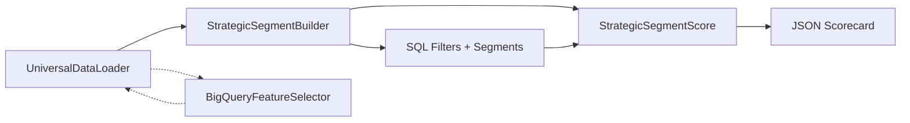
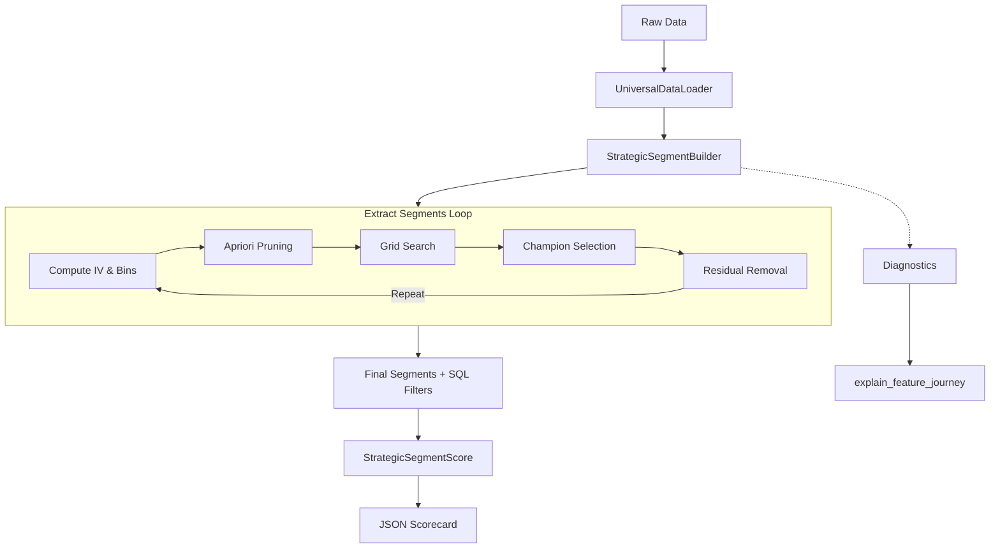
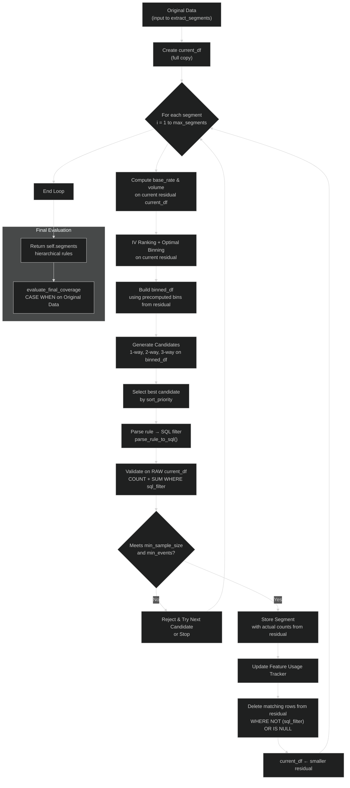

> [!IMPORTANT]
> **Legal Disclaimer**  
> This open‑source library (`RapidSegment`) is an independent, community‑driven predictive analytics framework. It is **completely unaffiliated** with any commercial products, SaaS platforms, or enterprise solutions of the same or similar name. Any overlap in nomenclature is purely coincidental.

<p align="center">
  
</p>

# 🚀 RapidSegment – Strategic Segmentation & Scorecard Engine

[](https://pypi.org/project/rapidsegment/)
[](https://www.python.org/downloads/)
[](https://opensource.org/licenses/MIT)

**RapidSegment** is an industrial‑grade, combinatorial heuristic engine for discovering high‑lift predictive segments and compiling them into transparent, production‑ready scorecards. It bridges the gap between black‑box ML and legacy SQL rules engines.

---

## 📖 Table of Contents
- [✨ Features](#-features)
- [🌳 Decision Trees vs RapidSegment](#-decision-trees-vs-rapidsegment)
- [⚡ Quick Start](#-quick-start)
- [🖥️ Web UI](#️-web-ui)
- [🧩 Components](#-components)
- [🏗️ System Architecture](#️-system-architecture)
- [⚙️ How It Works – Step by Step](#️-how-it-works--step-by-step)
- [📊 Statistical Foundations](#-statistical-foundations)
- [🔧 Configuration Reference](#-configuration-reference)
- [🤔 FAQs & Troubleshooting](#-faqs--troubleshooting)
- [🤝 Contributing](#-contributing)
- [📄 License](#-license)
---

## ✨ Features

- **🔎 Automated Rule Discovery** – Uses Optimal Binning (or fast naive quantile binning) + Apriori pruning to find multi‑way (1‑, 2‑, 3‑way) conditions that maximise lift and volume.
- **🧩 Hierarchical Segments** – Extracts mutually exclusive rules sequentially on a shrinking residual dataset, ensuring clean portfolio decomposition.
- **🔀 Adjacent-Bin Expansion** – Optionally merges neighbouring bins (`max_expansion_hops`) to recover higher-event rules that pure single-bin candidates miss.
- **⚡ Hyper‑Efficient & Out-of-Core** – Leverages **DuckDB** (disk-backed by default) for vectorised SQL aggregations; spills to disk so large datasets fit in limited RAM.
- **☁️ BigQuery Ready** – Optional feature screening runs natively inside Google BigQuery, downloading only the most predictive columns.
- **📦 Production‑Ready Outputs** – Exports pure ANSI SQL filters and a JSON scorecard with decile thresholds, ready for deployment.
- **📊 Transparent Weighting** – Uses the segment response rate to compute intuitive integer weights, while retaining lift, response rate, and capture rate for each segment.
- **🔬 Full Audit Trail** – `explain_feature_journey`, `explain_no_segments`, and `generate_feature_health_report` for complete diagnostics.

---

## 🌳 Decision Trees vs RapidSegment

Decision trees and RapidSegment both aim to create interpretable segments, but they are optimized for different jobs.

| Aspect | Decision Tree | RapidSegment |
|---|---|---|
| Primary goal | Fit a single tree that maximizes predictive accuracy | Discover transparent, business-friendly segments and scorecard-ready rules |
| Segment shape | Branches can split on different variables at different depths | Segments are built as explicit, hierarchical rules with SQL filters |
| Variable consistency | A branch may use a completely different feature path than another | Supports a cleaner, more stable rule structure and can reuse the same variable across segments when desired |
| Ease of use | Often requires model tuning, pruning, and interpretation of a tree structure | Designed for a straightforward workflow: ingest data → extract segments → score and export |
| Production fit | Good for predictive modeling, but tree structure can be awkward for operations teams | Better suited for scorecards, policy rules, SQL deployment, and explainable segmentation |
| Explainability | Interpretable, but can become hard to read at depth | Highly transparent because each segment is exposed as a rule and a SQL condition |

### Why RapidSegment is often the better fit

- It produces explicit rules that are easy to hand to analysts or operations teams.
- The output is already aligned with SQL and scorecard workflows, reducing the gap between modeling and deployment.
- It is easier to reason about when you want stable, reusable segmentation logic rather than a branching tree structure.
- It is well suited for scenarios where you want a fixed set of business rules, consistent segment definitions, and explainable weights.

In short, a decision tree is great when you want a predictive model structure; RapidSegment is better when you want transparent, deployable segments that are easy to understand and operationalize.

---


## ⚡ Quick Start

```python
import numpy as np
import pandas as pd
import duckdb
from rapidsegment import StrategicSegmentBuilder, StrategicSegmentScore

# 1. Synthetic data (or use your own)
np.random.seed(42)
n = 50_000
data = pd.DataFrame({
    "cust_id": [f"CUST_{i:05d}" for i in range(n)],
    "max_dpd_12m": np.random.choice([0,15,30,60,90], n, p=[0.7,0.15,0.08,0.05,0.02]),
    "utilization_avg_3m": np.random.uniform(0, 1.2, n),
    "risk_segment": np.random.choice(["Low","Medium","High"], n, p=[0.6,0.3,0.1]),
    "default_flag": np.random.choice([0,1], n, p=[0.95,0.05])
})

# Inject a strong rule to verify extraction
mask = (data["max_dpd_12m"] >= 60) & (data["utilization_avg_3m"] >= 0.85)
data.loc[mask, "default_flag"] = np.random.choice([0,1], mask.sum(), p=[0.2,0.8])

# 2. Configure the builder
builder = StrategicSegmentBuilder(
    target="default_flag",
    top_n_vars=15,
    max_segments=5,
    max_feature_reuse=1,
    param_grid={"min_sample_size": [1000, 2500, 5000], "min_lift": [1.5, 2.0, 3.0]},
    enable_diversity=True,
    feature_groups={
        "delinquency": ["max_dpd_12m", "risk_segment"],
        "utilization": ["utilization_avg_3m"]
    },
    ignore_features=["cust_id"],
    sort_priority="rate_lift_count",   # current default
    binning_method="optimal",          # or "naive"
    max_expansion_hops=1,              # enable adjacent-bin expansion
)

# 3. Extract hierarchical segments
segments = builder.extract_segments(data)
print(pd.DataFrame(segments)[["segment_id","count","lift","sql_filter"]])

# 4. Audit a feature's journey
builder.explain_feature_journey("max_dpd_12m")

# 5. Build scorecard
segment_cols = []
scoring_df = data[["cust_id","default_flag"]].copy()
for seg in segments:
    col = f"SEG_{seg['segment_id']}"
    scoring_df[col] = duckdb.sql(f"SELECT ({seg['sql_filter']}) FROM data").df().astype(int)
    segment_cols.append(col)

scorer = StrategicSegmentScore(
    target_col="default_flag",
    primary_key="cust_id",
    segment_cols=segment_cols,
)
model = scorer.calculate_and_export_weights(scoring_df, "model.json")

print("Deciles:", model["decile_min_thresholds"])
```

`sort_priority` controls how candidate segments are ranked during extraction.
The exported model retains each `weight` together with `lift`, `response_rate`, and `capture_rate` for auditability.

## 🖥️ Web UI

RapidSegment also ships a no-code **Streamlit** app that wraps the engine above. Install the UI extra and launch it with one command:

```bash
pip install "rapidsegment[ui]"
rapidsegment-ui          # opens http://localhost:8501
```

Full installation, launch, and per-module details are in the [UI guide](https://github.com/B2BDA/RapidSegment/blob/main/docs/UI.md). In short:

- **M1 · Data Loader & Profiling** — load / profile data, set metadata (type overrides create a modified DuckDB dataset), and name the dataset.
- **M2 · Workbench** — configure the `StrategicSegmentBuilder` and preview.
- **M3 · Execution Console** — run extraction with a live timeline, logs, SQL inspector, cancel-with-partial-save, and experiment persistence.
- **M4 · Results Dashboard** — segments table, Plotly charts, scorecard, Feature Journey, and Feature Health Report.
- **M5 · Leaderboard** — best experiment per dataset ranked by KPI with a best-performer highlight.
- **M6 · Arena** — 1v1 experiment comparison (KPI face-off, parameter diff, segment overlap, SQL diff).

A sidebar **Exit UI** button stops the Streamlit server.

## 🧩 Components

RapidSegment is built from four decoupled, specialised modules. They can be used together or independently, depending on your pipeline needs.



| Component | Purpose |
|-----------|---------|
| **`StrategicSegmentBuilder`** | Finds high‑lift rules using Apriori pruning and grid search, outputs SQL filters. |
| **`StrategicSegmentScore`** | Converts binary segment flags into a weighted scorecard with decile thresholds. |
| **`BigQueryFeatureSelector`** | Screens hundreds of features in BigQuery using IV and variance filters. |
| **`UniversalDataLoader`** | Ingests CSV, Parquet, Excel, Arrow, and BigQuery tables into PyArrow tables. |

### 📥 `UniversalDataLoader`
- **Purpose**: Ingests data from multiple sources and normalises it into a PyArrow Table.
- **Supports**: CSV, Parquet, Arrow/Feather, Excel, and BigQuery (via streaming).
- **Key Benefit**: Automatically casts numeric columns to `float64` for consistent precision downstream.

### 🔍 `StrategicSegmentBuilder`
- **Purpose**: The core segmentation engine. It discovers high‑lift rules using Optimal Binning + Apriori pruning + grid search.
- **Outputs**: A list of segments, each with a pure ANSI SQL `WHERE` clause, plus metrics (count, rate, lift).
- **Diagnostics**
  - `explain_feature_journey(feature)` – full audit trail of a feature across iterations.
  - `explain_no_segments()` – human-readable report explaining why extraction stopped early or returned zero segments.
  - `generate_feature_health_report(data, features)` – DuckDB-native bin-level health report (counts, events, response rate, missing flag).

### 📊 `StrategicSegmentScore`
- **Purpose**: Converts binary segment flags into a weighted scorecard with decile thresholds.
- **Weighting**: Uses the segment response rate rounded to an integer weight.
- **Output**: A JSON artifact with model metadata, per-segment weights, and decile cutoffs.
- **Active population handling**: Baseline customers with a zero total score are excluded from decile calibration so thresholds are derived from the active scored population.

### ☁️ `BigQueryFeatureSelector`
- **Purpose**: Screens hundreds of features directly inside Google BigQuery using IV and variance filters.
- **Benefit**: Only downloads features that meet the thresholds, saving network and memory costs.
- **Integration**: Returns a DuckDB relation of retained feature names and their IVs.

### Quick‑Reference Matrix

| Component | Primary Role | Key Output | Data Format |
|-----------|--------------|------------|-------------|
| `UniversalDataLoader` | Ingestion | PyArrow Table | CSV, Parquet, Excel, Arrow, BQ |
| `StrategicSegmentBuilder` | Rule Discovery | Segment SQL + Metrics | List of dicts |
| `StrategicSegmentScore` | Scorecard Compilation | JSON Model | JSON file |
| `BigQueryFeatureSelector` | Feature Screening | Filtered Feature List | DuckDB relation |

---

## 🏗️ System Architecture

Below is the high‑level flow of the entire pipeline, from raw data to a deployable scorecard.


#### Flow of Input Data

## ⚙️ How It Works – Step by Step

### 1. Feature Ranking & Binning
Optimal Binning (via `optbinning`) computes the Information Value (IV) for each feature, automatically handling categorical and numerical types. Only the top `top_n_vars` features proceed.

### Naive Binning (Fast Quantile Path)

When `binning_method="naive"`, the engine skips OptBinning and builds bins directly inside DuckDB:

**Numerical features**
- Compute `naive_bins` quantiles with `QUANTILE_CONT`.
- Force the outermost edges to `-∞` and `+∞`.
- Assign every row to a half-open interval: `[lower, upper)`.
- Nulls go into a dedicated `Missing` bin.

**Categorical features**
- Each distinct value becomes its own bin: `[value]`.
- Null / empty / “None” / “nan” values are grouped into `Missing`.

**Why it exists**
- Extremely fast on large data (pure SQL, no Python loops).
- Produces stable, equal-frequency bins that are easy to interpret.
- Works seamlessly with **adjacent-bin expansion** (`max_expansion_hops > 0`), which can later merge neighbouring bins to recover higher-event rules.

**Trade-off**
- Optimal Binning usually finds slightly more predictive cut-points.
- Naive binning is preferred when speed or simplicity matters more than maximal IV.

Both paths feed the same downstream pipeline (IV ranking → Apriori → expansion → champion selection).

### 2. Apriori Pruning
The engine evaluates combinations in a layered fashion:


If a 1‑way rule fails the thresholds, all higher‑order combinations containing that feature are pruned – drastically reducing the search space.

## How 1-Way → 2-Way → 3-Way Segment Search Works
 
RapidSegment builds candidate segments in layers: it tests single features first, then only pairs the survivors, then only tries triplets whose *every* underlying pair already proved itself. This is Apriori-style pruning — the same idea used in market-basket analysis — applied to churn/response segmentation.
 
### Worked example — from 1-way to 3-way on real-looking data
 
Say the target is `churned` (1 = customer left), the overall base rate is **20%** (2,000 of 10,000 customers churned), `min_lift = 1.5`, and `min_sample_size = 300`. Three binned features are in play: `tenure_bin`, `plan_type`, `support_tickets_bin`.
 
#### Step 1 — 1-way: test each bin of each feature alone
 
Every individual bin is checked against the base rate. A rule only survives if its `count ≥ min_sample_size` and `lift ≥ min_lift` (`lift = segment_rate / base_rate`):
 
| Rule (1-way) | Count | Churn rate | Lift | Survives? |
|---|---|---|---|:---:|
| `tenure_bin = [0-3mo]` | 1,200 | 42% | 2.1x | ✅ |
| `plan_type = [Basic]` | 900 | 35% | 1.75x | ✅ |
| `support_tickets_bin = [3+]` | 600 | 55% | 2.75x | ✅ |
| `plan_type = [Premium]` | 800 | 8% | 0.4x | ❌ (below 1.0, protective not risky) |
| `tenure_bin = [12mo+]` | 3,000 | 6% | 0.3x | ❌ |
 
Only bins that pass move forward. Say the survivors are `{[0-3mo], [Basic], [3+ tickets]}` — call them **A**, **B**, **C** for short. Anything that failed (like `[Premium]` or `[12mo+]`) is now completely dropped: it will never be tried in any pair or triplet, because pairing a bad bin with anything can't undo the fact that alone it wasn't predictive enough at the volume required.
 
#### Step 2 — 2-way: pair up only the survivors
 
With 3 survivors there are `C(3,2) = 3` possible pairs: `A+B`, `A+C`, `B+C`. Each pair is aggregated as its own joint segment:
 
| Rule (2-way) | Count | Churn rate | Lift | Survives? |
|---|---|---|---|:---:|
| `A+B` = `[0-3mo] AND [Basic]` | 420 | 51% | 2.55x | ✅ |
| `A+C` = `[0-3mo] AND [3+ tickets]` | 310 | 58% | 2.9x | ✅ |
| `B+C` = `[Basic] AND [3+ tickets]` | 180 | 60% | 3.0x | ❌ — count 180 < min_sample_size 300 |
 
Notice `B+C` actually has the *highest* churn rate and lift of the three pairs — but it's still rejected, because too few customers (180) fall into that exact overlap to trust the number. This is the key trade-off: **survival is about count AND lift together, not lift alone.**
 
Survivors: `valid_2way_sets = { {A,B}, {A,C} }`.
 
#### Step 3 — 3-way: only try triplets where every pair inside them already passed
 
With 3 bins there's only one possible triplet: `A+B+C`. Before RapidSegment even bothers aggregating it, it checks: are all three of its pairs — `{A,B}`, `{A,C}`, `{B,C}` — in `valid_2way_sets`?
 
| Pair inside the triplet | In `valid_2way_sets`? |
|---|:---:|
| `{A,B}` | ✅ |
| `{A,C}` | ✅ |
| `{B,C}` | ❌ (rejected in Step 2 for low count) |
 
Because `{B,C}` never passed, the triplet `A+B+C` is **skipped entirely** — it is never even aggregated, no matter how strong its true joint churn rate might be. This is the pruning payoff: instead of testing every possible triplet from scratch, the engine only tests triplets whose *every* pairwise sub-relationship already proved itself statistically solid on its own.
 
### Why prune this way instead of just testing every triplet directly?
 
- **Speed:** with `top_n_vars = 15`, testing all triplets directly is `C(15,3) = 455` SQL aggregations. Pruning by pairwise survival first can cut that dramatically, since most triplets get eliminated before ever touching the data.
- **The cost:** a genuinely strong 3-way interaction can be missed if one of its underlying pairs happened to fall just under `min_sample_size` (as `{B,C}` did above at count 180) — even if the full triplet would have had a healthy count. This is the same trade-off classic Apriori pruning makes in market-basket analysis: cheap, scalable, but not exhaustive.
---

### 3. Grid Search
For each iteration, the engine sweeps over a user‑defined grid of `(min_sample_size, min_lift)` values. Each grid point produces a candidate champion. After all grid points are evaluated, the global champion is chosen by sorting on `(lift, count, rate)`.

### 4. Champion Validation & Extraction
The champion’s SQL filter is validated against the **raw residual** to ensure it meets the absolute hard constraints. Only then is it accepted.

### 5. Residual Update (NULL‑safe)
Rows matching the rule are removed using:
```sql
WHERE NOT (rule) OR (rule) IS NULL
```
This guarantees that the residual dataset exactly matches the `CASE`‑based hierarchical segmentation used in `evaluate_final_coverage`.

### 6. Loop
Steps 1‑5 repeat until either `max_segments` is reached or no more rules can be found.

### 7. Scorecard Compilation
Once all segments are extracted, they are converted to binary flags and passed to `StrategicSegmentScore`. This module computes weights from the segment response rate and calibrates decile thresholds from the active scored population.

---

## 📊 Statistical Foundations

### Information Value (IV)
* **WOE (Weight of Evidence)**: Measures the predictive power of an individual bin relative to the overall baseline population. It establishes how much a specific value band shifts the log-odds of an event occurring:
  $$WOE = \ln \left( \frac{\text{Percent of Non-Events}}{\text{Percent of Events}} \right)$$
* **IV (Information Value)**: Summarizes the overall predictive power of the entire variable across all its discrete bins:
  $$IV = \sum \left( \text{Percent of Non-Events} - \text{Percent of Events} \right) \times WOE$$
  
Variables with $IV \times 100 > 30$ are considered **strong** predictors.

### Segment Weight Calculation
For a segment $s$:

- **Response Rate**: $RR_s = \frac{Events_s}{Count_s}$  
- **Capture Rate**: $CR_s = \frac{Events_s}{TotalEvents}$  
- **Lift**: $L_s = \frac{RR_s}{BaselineRate}$

The raw weight is:

```text
RawWeight_s =
    RR_s × 100        
```

The exported weight is the rounded integer value of this raw weight. The scorer also retains the segment lift, response rate, and capture rate for auditability.

### Decile Calibration
Scores are computed as the sum of weights for all segments a customer triggers. Customers are sorted in **descending** order and split into 10 buckets using DuckDB quantiles. Before this step, baseline customers with a score of 0 are removed so the thresholds apply to the active scored population. The scorer also warns when too few distinct non-zero segment weights are available, because this can cause repeated thresholds.

---

## 🔧 Configuration Reference

### `StrategicSegmentBuilder`

| Parameter | Type | Default | Description |
|-----------|------|---------|-------------|
| `target` | `str` | **Required** | Binary target column name. |
| `n_jobs` | `int` | `-1` | Parallel workers for IV/binning (`-1` = all but one core). |
| `min_sample_size` | `int` | `1000` | Absolute minimum rows for a valid rule. |
| `min_lift` | `float` | `1.5` | Absolute minimum lift (hard constraint). |
| `min_events` | `int` | `100` | Minimum positive events for a valid rule. |
| `top_n_vars` | `int` | `15` | Number of top features passed to the Apriori engine. |
| `max_segments` | `int` | `10` | Maximum segments to extract. |
| `max_feature_reuse` | `int` | `1` | Max times any single feature may appear across segments. |
| `param_grid` | `dict` | `{}` | Optional grid of `{min_sample_size, min_lift}` to sweep. |
| `enable_diversity` | `bool` | `False` | Block combinations that mix features from the same group. |
| `enable_1way` / `enable_2way` / `enable_3way` | `bool` | `True` | Toggle 1-, 2-, and 3-way rules. |
| `feature_groups` | `dict` | `{}` | Business-category → column list (used by diversity). |
| `ignore_features` | `list` | `[]` | Columns to exclude before IV calculation. |
| `sort_priority` | `str` | `"rate_lift_count"` | Ranking key for champion selection (many variants supported). |
| `binning_method` | `str` | `"optimal"` | `"optimal_cart"` or `optimal` (OptBinning with CART) or `"optimal_quantile"` (OptBinning with Quantile) or `"naive"` (quantile bins). |
| `naive_bins` | `int` | `5` | Number of quantile bins when `binning_method="naive"`. |
| `max_expansion_hops` | `int` | `0` | Adjacent-bin merge distance (0 = disabled). |
| `selection_metric` | `str` | `"iv"` | Rank features by `"iv"` or `"response_rate"`. |
| `expand_log_mode` | `str` | `"none"` | Expansion logging: `"none"` \| `"summary"` \| `"champion"` \| `"full"`. |
| `db_path` / `db_temp_dir` | `str` | `None` | Optional explicit DuckDB file + temp dir (auto-created otherwise). |

**Output** – list of dicts with keys: `segment_id`, `rule_string`, `sql_filter`, `count`, `rate`, `lift`, `meta_applied_sample_size`, `meta_applied_min_lift`.

### `StrategicSegmentScore`

| Parameter | Type | Description |
|-----------|------|-------------|
| `target_col` | `str` | Binary target column. |
| `primary_key` | `str` | Unique row identifier. |
| `segment_cols` | `list` | List of binary segment flag columns. |

**Export** – JSON artifact with `model_metadata`, `segment_weights`, and `decile_min_thresholds`.

---

## 🤔 FAQs & Troubleshooting

**Q: Why are later segments sometimes stronger in lift than earlier ones?**  
A: The segment extraction process is entirely sequential and operates on a shrinking residual population. Once a champion rule is discovered, its matching records are deleted from the working environment before the next iteration begins.
Because of this cascading extraction:  
    **`Local Optimization`**: The engine optimizes parameters and evaluates candidates based purely on the residual portfolio left behind by previous segments. A rule that yields massive lift on a specific, purified subset of data might look less dominant if it had been evaluated against the noisy baseline of the entire original population.  
    **`Changing Base Rates`**: As high-risk or high-performing records are stripped away in early rounds, the baseline event rate of the remaining pool shifts dynamically. This shifting baseline changes the mathematical benchmark for what constitutes a "high-lift" rule during that specific loop.  Consequently, when evaluate_final_coverage maps all rules simultaneously back over the original, unfiltered dataset, the global KPIs can naturally surface instances where a later segment outperforms an earlier one.  

**Q: My deciles 3+ have a threshold of 0 – what’s wrong?**  
A: This usually means the scored population contains too few active segments or too few distinct non-zero segment weights. The scorer excludes zero-score customers from decile calibration, so repeated thresholds can occur when the model produces only a handful of active scores. Relax constraints by increasing `max_segments`, raising `top_n_vars`, or lowering `min_lift`/`min_sample_size` so more segments can be discovered. If the scorecard still collapses, interpret the result as score tiers rather than a smooth decile ladder.

**Q: Why doesn’t the engine support OR‑based rules?**  
A: OR breaks the Apriori pruning property: if A fails and B fails, A AND B will also fail (prune safe), but A OR B might succeed – forcing an exhaustive search. The engine prioritises speed and stability by focusing on AND‑based intersections.

**Q: Can I use my own data loader?**  
A: Yes – just pass a DuckDB‑compatible table (e.g., a Pandas DataFrame) directly to `extract_segments()` or `calculate_and_export_weights()`.

**Q: Does the engine handle missing values (NULLs) correctly?**  
A: Yes. Both extraction and evaluation treat NULLs consistently – NULL conditions do not match the rule and are carried forward to later segments (or the `ELSE 0` bucket).

**Q: My dataset may contain target leaked feature (100% correaltion with Target). Will it be taken as important feature?**
A: No. The feature will be dropped by Optbinning during segment creation steps. Furthermore, if you are using BigQueryFeatureSelector the feature IV will be marked as 0 and not considered.

---

## 🤝 Contributing

We welcome contributions! Please open an issue or pull request on [GitHub](https://github.com/your-org/rapidsegment).  
For major changes, please discuss them first via an issue.

---

## 📄 License

This project is licensed under the MIT License – see the [LICENSE](LICENSE) file for details.

---
**Built with ❤️ by Bishwarup Biswas**  
Special Thanks to Mr. [Guillermo Navas Palencia](https://github.com/guillermo-navas-palencia)  for creating [Optbinning](https://github.com/guillermo-navas-palencia/optbinning) library.

_Independent, open‑source, and ready for production._
```

