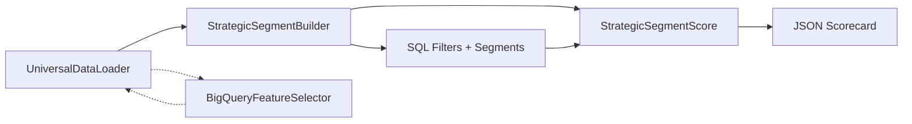
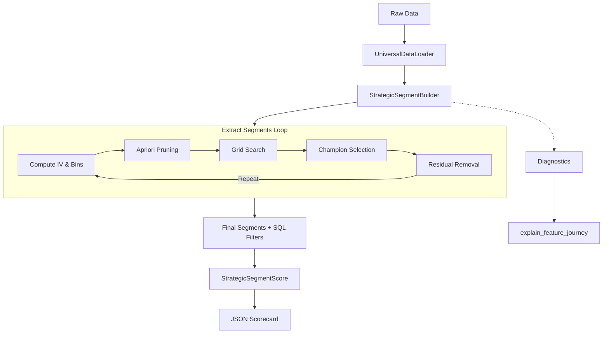
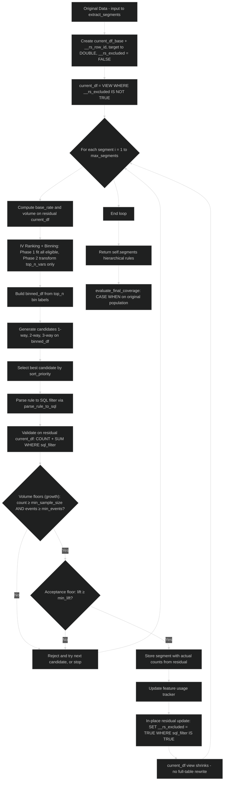
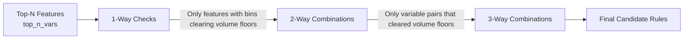

> [!IMPORTANT]
> **Legal Disclaimer**  
> This open‑source library (`RapidSegment`) is an independent, community‑driven predictive analytics framework. It is **completely unaffiliated** with any commercial products, SaaS platforms, or enterprise solutions of the same or similar name. Any overlap in nomenclature is purely coincidental.

<p align="center">
  
</p>

# 🚀 RapidSegment – Strategic Segmentation & Scorecard Engine

[](https://pypi.org/project/rapidsegment/)
[](https://www.python.org/downloads/)
[](https://opensource.org/licenses/MIT)

**RapidSegment** is an industrial‑grade, combinatorial heuristic engine for discovering high‑lift predictive segments and compiling them into transparent, production‑ready scorecards. It bridges the gap between black‑box ML and legacy SQL rules engines.

[30 Second Promo](https://github.com/user-attachments/assets/fac07334-4e2e-4062-9ced-232833295e54)

## Rapid Segment Interactive Explainer (Must Try)
[Explainer](https://b2bda.github.io/RapidSegment/)

---

## 📖 Table of Contents
- [✨ Features](#-features)
- [🌳 Decision Trees vs RapidSegment](#-decision-trees-vs-rapidsegment)
- [⚡ Quick Start](#-quick-start)
- [🖥️ Web UI](#️-web-ui)
- [🧩 Components](#-components)
- [🏗️ System Architecture](#️-system-architecture)
- [⚙️ How It Works – Step by Step](#️-how-it-works--step-by-step)
- [📊 Statistical Foundations](#-statistical-foundations)
- [🔧 Configuration Reference](#-configuration-reference)
- [🔋 Single Data Artifact & Memory Efficiency](#-single-data-artifact--memory-efficiency)
- [🤔 FAQs & Troubleshooting](#-faqs--troubleshooting)
- [🤝 Contributing](#-contributing)
- [📄 License](#-license)
---

## ✨ Features

- **🔎 Automated Rule Discovery** – Uses Optimal Binning (or fast naive quantile binning) + Apriori pruning to find multi‑way (1‑, 2‑, 3‑way) conditions that maximise lift and volume.
- **🧩 Hierarchical Segments** – Extracts mutually exclusive rules sequentially on a shrinking residual population, ensuring clean portfolio decomposition.
- **🔀 Adjacent-Bin Expansion** – Optionally merges neighbouring bins (`max_expansion_hops`) to recover higher-event rules that pure single-bin candidates miss.
- **⚡ Hyper‑Efficient & Out-of-Core** – Leverages **DuckDB** (disk-backed by default) for vectorised SQL aggregations; spills to disk so large datasets fit in limited RAM.
- **🔋 Single Data Artifact (opt-in)** – With `persist_db=True`, extraction keeps one DuckDB file for evaluate / health / score reuse; residual rows are flagged in place (`__rs_excluded`) instead of rewriting the full table each iteration.
- **📉 Two-Phase Binning** – Fits IV ranking across all eligible features, then materialises full-length bin-label arrays only for `top_n_vars`, bounding peak Python memory.
- **📁 DuckDB‑Native Ingestion & Zero-Copy Path** – `UniversalDataLoader.stream_to_duckdb()` writes any source (local file, in-memory object, BigQuery) straight into a `.duckdb` file and returns its path; `extract_segments`, `evaluate_final_coverage`, and `calculate_and_export_weights` then consume it zero-copy (table `udl_data` for the builder, `df`/named table for the scorer) — no Python frame ever materialised.
- **☁️ BigQuery Ready** – Optional feature screening runs natively inside Google BigQuery, downloading only the most predictive columns.
- **📦 Production‑Ready Outputs** – Exports pure ANSI SQL filters and a JSON scorecard with decile thresholds, ready for deployment.
- **📊 Transparent Weighting** – Uses the segment response rate to compute intuitive integer weights, while retaining lift, response rate, and capture rate for each segment.
- **🔬 Full Audit Trail** – `explain_feature_journey`, `explain_no_segments`, and `generate_feature_health_report` for complete diagnostics.
---

## 🌳 Decision Trees vs RapidSegment

Decision trees and RapidSegment both aim to create interpretable segments, but they are optimized for different jobs.

| Aspect | Decision Tree | RapidSegment |
|---|---|---|
| Primary goal | Fit a single tree that maximizes predictive accuracy | Discover transparent, business-friendly segments and scorecard-ready rules |
| Segment shape | Branches can split on different variables at different depths | Segments are built as explicit, hierarchical rules with SQL filters |
| Variable consistency | A branch may use a completely different feature path than another | Supports a cleaner, more stable rule structure and can reuse the same variable across segments when desired |
| Ease of use | Often requires model tuning, pruning, and interpretation of a tree structure | Designed for a straightforward workflow: ingest data → extract segments → score and export |
| Production fit | Good for predictive modeling, but tree structure can be awkward for operations teams | Better suited for scorecards, policy rules, SQL deployment, and explainable segmentation |
| Explainability | Interpretable, but can become hard to read at depth | Highly transparent because each segment is exposed as a rule and a SQL condition |

### Why RapidSegment is often the better fit

- It produces explicit rules that are easy to hand to analysts or operations teams.
- The output is already aligned with SQL and scorecard workflows, reducing the gap between modeling and deployment.
- It is easier to reason about when you want stable, reusable segmentation logic rather than a branching tree structure.
- It is well suited for scenarios where you want a fixed set of business rules, consistent segment definitions, and explainable weights.
  
#### Empirical 1v1: Decision Tree vs RapidSegment

See the full showdown notebook:  
**[DT vs RS comparison](https://github.com/B2BDA/RapidSegment/blob/main/Notebooks/DT_vs_RS/compare_segmenters_general.ipynb)**

On matched runs with similar population and event capture:

| Pattern | Decision tree | RapidSegment |
|--------|----------------|--------------|
| Lift / response rate | Highly variable across segments | More stable segment to segment |
| Segment size | Often large (many customers per rule) | Typically tighter (on the order of ~1K rows per segment in this study) |
| Trade-off | High volume can inflate false positives | Lower volume per segment, steadier response rates |

**Takeaway:** Similar overall capture does not imply similar segment quality. Trees tend to grow broad leaves that pull in more non-events; RapidSegment favors smaller, higher-signal rules with more consistent lift and response rate.

In short, a decision tree is great when you want a predictive model structure; RapidSegment is better when you want transparent, deployable segments that are easy to understand and operationalize.

---


## ⚡ Quick Start

```python
import numpy as np
import pandas as pd
import duckdb
from rapidsegment import StrategicSegmentBuilder, StrategicSegmentScore

# 1. Synthetic data (or use your own)
np.random.seed(42)
n = 50_000
data = pd.DataFrame({
    "cust_id": [f"CUST_{i:05d}" for i in range(n)],
    "max_dpd_12m": np.random.choice([0,15,30,60,90], n, p=[0.7,0.15,0.08,0.05,0.02]),
    "utilization_avg_3m": np.random.uniform(0, 1.2, n),
    "risk_segment": np.random.choice(["Low","Medium","High"], n, p=[0.6,0.3,0.1]),
    "default_flag": np.random.choice([0,1], n, p=[0.95,0.05])
})

# Inject a strong rule to verify extraction
mask = (data["max_dpd_12m"] >= 60) & (data["utilization_avg_3m"] >= 0.85)
data.loc[mask, "default_flag"] = np.random.choice([0,1], mask.sum(), p=[0.2,0.8])

# 2. Configure the builder
builder = StrategicSegmentBuilder(
    target="default_flag",
    top_n_vars=15,
    max_segments=5,
    max_feature_reuse=1,
    param_grid={"min_sample_size": [1000, 2500, 5000], "min_lift": [1.5, 2.0, 3.0]},
    enable_diversity=True,
    feature_groups={
        "delinquency": ["max_dpd_12m", "risk_segment"],
        "utilization": ["utilization_avg_3m"]
    },
    ignore_features=["cust_id"],
    sort_priority="rate_lift_count",   # current default
    binning_method="optimal",          # or "naive"
    max_expansion_hops=1,              # enable adjacent-bin expansion
)

# 3. Extract hierarchical segments
segments = builder.extract_segments(data)
print(pd.DataFrame(segments)[["segment_id","count","lift","sql_filter"]])

# 4. Audit a feature's journey
builder.explain_feature_journey("max_dpd_12m")

# 5. Build scorecard
segment_cols = []
scoring_df = data[["cust_id","default_flag"]].copy()
for seg in segments:
    col = f"SEG_{seg['segment_id']}"
    scoring_df[col] = duckdb.sql(f"SELECT ({seg['sql_filter']}) FROM data").df().astype(int)
    segment_cols.append(col)

scorer = StrategicSegmentScore(
    target_col="default_flag",
    primary_key="cust_id",
    segment_cols=segment_cols,
)
model = scorer.calculate_and_export_weights(scoring_df, "model.json")

print("Deciles:", model["decile_min_thresholds"])
```

`sort_priority` controls how candidate segments are ranked during extraction.
The exported model retains each `weight` together with `lift`, `response_rate`, and `capture_rate` for auditability.

### DuckDB‑Native / Large‑File Quick Start

Refer Example: [Handling Large Data](https://github.com/B2BDA/RapidSegment/blob/main/Notebooks/Examples/Example3_Big_Data.ipynb)

For files too big for comfortable in‑memory loading — or when you already keep data in DuckDB — stream straight into a `.duckdb` file and let every engine stage read it zero-copy from disk:

```python
import duckdb
from rapidsegment import StrategicSegmentBuilder, StrategicSegmentScore
from rapidsegment.utils.data_loader import UniversalDataLoader

# 1. Stream any source into a .duckdb file (db_path is optional -> auto temp path)
out = UniversalDataLoader(file_path="bank_train.csv").stream_to_duckdb("bank_data")
# out == absolute path; the file now holds table `udl_data` plus a `df` view

# 2. Extract segments straight off the file (builder db_path must differ / be None)
builder = StrategicSegmentBuilder(target="target_col", db_path=None)
segments = builder.extract_segments(out)            # reads udl_data, zero-copy
builder.evaluate_final_coverage(out)

# 3. Prepare a scored table inside the same database...
con = duckdb.connect(out)
con.execute("""
    CREATE OR REPLACE TABLE predicted AS SELECT
        id, target,
        (age > 45)::INTEGER         AS seg_1,
        (region = 'east')::INTEGER  AS seg_2
    FROM udl_data
""")
con.close()                                          # close before the scorer attaches

# 4. ...and point the scorer at it by name
scorer = StrategicSegmentScore("target_col", "id", ["seg_1", "seg_2"])
model = scorer.calculate_and_export_weights(out, "model.json", table_name="predicted")

# 5. Any DuckDB table -> PyArrow for ad-hoc analysis
arrow = UniversalDataLoader.duckdb_to_arrow(out, table_name="predicted")
```

## 🖥️ Web UI

RapidSegment ships a no-code web app:

### Streamlit UI
Install the UI extra and launch it with one command:

```bash
pip install "rapidsegment[ui]"
rapidsegment-ui          # opens http://localhost:8501
```

Full installation, launch, and per-module details are in the [UI guide](https://github.com/B2BDA/RapidSegment/blob/main/docs/UI.md). In short:

- **M1 · Data Loader & Profiling** — load / profile data, set metadata (type overrides create a modified DuckDB dataset), and name the dataset.
- **M2 · Workbench** — configure the `StrategicSegmentBuilder` and preview.
- **M3 · Execution Console** — run extraction with a live timeline, logs, SQL inspector, cancel-with-partial-save, and experiment persistence.
- **M4 · Results Dashboard** — segments table, Plotly charts, scorecard, Feature Journey, and Feature Health Report.
- **M5 · Leaderboard** — best experiment per dataset ranked by KPI with a best-performer highlight.
- **M6 · Arena** — 1v1 experiment comparison (KPI face-off, parameter diff, segment overlap, SQL diff).

A sidebar **Exit UI** button stops the Streamlit server.

## 🧩 Components

RapidSegment is built from four decoupled, specialised modules. They can be used together or independently, depending on your pipeline needs.



| Component | Purpose |
|-----------|---------|
| **`StrategicSegmentBuilder`** | Finds high‑lift rules using Apriori pruning and grid search, outputs SQL filters. |
| **`StrategicSegmentScore`** | Converts binary segment flags into a weighted scorecard with decile thresholds. |
| **`BigQueryFeatureSelector`** | Screens hundreds of features in BigQuery using IV and variance filters. |
| **`UniversalDataLoader`** | Ingests CSV, Parquet, Excel, Arrow, and BigQuery tables into PyArrow tables. |

### 📥 `UniversalDataLoader`
- **Purpose**: Ingests data from multiple sources and normalises it into a PyArrow Table — or streams it straight into a persisted DuckDB database file.
- **Supports**: CSV/TSV, Parquet, Arrow/Feather (DuckDB on-disk streaming), Excel, and BigQuery.
- **`stream_to_duckdb(db_path=None, path=..., data=..., table_name="udl_data")`**
  - Streams any source (a local file via `path=` or the constructor's `file_path=`, an in-memory `data=` object, or BigQuery identifiers) directly into a `.duckdb` file — memory-light for multi-GB files.
  - `db_path` is optional: omit it and a unique `rapidsegment_udl_*.duckdb` is auto-created under the system temp dir. A `.duckdb` extension is appended automatically and the parent directory is created as needed.
  - Returns the **absolute path**, usable directly by `extract_segments`, `evaluate_final_coverage`, and `calculate_and_export_weights`.
  - Writes the data table (default `udl_data`) plus lightweight `udl_data`/`df` view aliases so the builder, evaluator, and scorer all find what they expect regardless of `table_name`; numeric columns are cast to `float64` (`DOUBLE`) on-disk.
- **`duckdb_to_arrow(db, table_name="udl_data")`**: reads any table/view from a DuckDB file (or an open `duckdb` connection) back into a PyArrow Table.
- **Key Benefit**: Automatically casts numeric columns to `float64` for consistent precision downstream.

### 🔍 `StrategicSegmentBuilder`
- **Purpose**: The core segmentation engine. It discovers high‑lift rules using Optimal Binning + Apriori pruning + grid search.
- **Outputs**: A list of segments, each with a pure ANSI SQL `WHERE` clause, plus metrics (count, rate, lift).
- **Diagnostics**
  - `explain_feature_journey(feature)` – full audit trail of a feature across iterations.
  - `explain_no_segments()` – human-readable report explaining why extraction stopped early or returned zero segments.
  - `generate_feature_health_report(data, features)` – DuckDB-native bin-level health report (counts, events, response rate, missing flag).

### 📊 `StrategicSegmentScore`
- **Purpose**: Converts binary segment flags into a weighted scorecard with decile thresholds.
- **Weighting**: Uses the segment response rate rounded to an integer weight.
- **Output**: A JSON artifact with model metadata, per-segment weights, and decile cutoffs.
- **Active population handling**: Baseline customers with a zero total score are excluded from decile calibration so thresholds are derived from the active scored population.
- **Input table**: Reads the table named by `table_name` (default `df`) from the DuckDB file you pass — build your scored table (e.g. `predicted`) inside the database and point the scorer at it with `table_name="predicted"`.

### ☁️ `BigQueryFeatureSelector`
- **Purpose**: Screens hundreds of features directly inside Google BigQuery using IV and variance filters.
- **Benefit**: Only downloads features that meet the thresholds, saving network and memory costs.
- **Integration**: Returns a DuckDB relation of retained feature names and their IVs.

### Quick‑Reference Matrix

| Component | Primary Role | Key Output | Data Format |
|-----------|--------------|------------|-------------|
| `UniversalDataLoader` | Ingestion / streaming | `.duckdb` path (`udl_data` + `df`) or PyArrow Table | CSV, Parquet, Excel, Arrow, BQ, DuckDB |
| `StrategicSegmentBuilder` | Rule Discovery | Segment SQL + Metrics | List of dicts |
| `StrategicSegmentScore` | Scorecard Compilation | JSON Model | JSON file |
| `BigQueryFeatureSelector` | Feature Screening | Filtered Feature List | DuckDB relation |

---

## 🏗️ System Architecture

Below is the high‑level flow of the entire pipeline, from raw data to a deployable scorecard.


#### Flow of Input Data

## ⚙️ How It Works – Step by Step

### 1. Feature Ranking & Binning
Optimal Binning (via `optbinning`) computes the Information Value (IV) for each feature, automatically handling categorical and numerical types. Only the top `top_n_vars` features proceed.

### Naive Binning (Fast Quantile Path)

When `binning_method="naive"`, the engine skips OptBinning and builds bins directly inside DuckDB:

**Numerical features**
- Compute `naive_bins` quantiles with `QUANTILE_CONT`.
- Force the outermost edges to `-∞` and `+∞`.
- Assign every row to a half-open interval: `[lower, upper)`.
- Nulls go into a dedicated `Missing` bin.

**Categorical features**
- Each distinct value becomes its own bin: `[value]`.
- Null / empty / “None” / “nan” values are grouped into `Missing`.

**Why it exists**
- Extremely fast on large data (pure SQL, no Python loops).
- Produces stable, equal-frequency bins that are easy to interpret.
- Works seamlessly with **adjacent-bin expansion** (`max_expansion_hops > 0`), which can later merge neighbouring bins to recover higher-event rules.

**Trade-off**
- Optimal Binning usually finds slightly more predictive cut-points.
- Naive binning is preferred when speed or simplicity matters more than maximal IV.

Both paths feed the same downstream pipeline (IV ranking → Apriori → expansion → champion selection).

### 2. Apriori Pruning
The engine evaluates combinations in a layered fashion:



The pruning trigger at each layer is **volume only** — a rule clears the floor when `count ≥ min_sample_size` **and** `events ≥ min_events`. `min_lift` is deliberately **not** part of pruning: it is a hard *acceptance* floor applied to candidate rules afterwards, at the grid shortlist and the final raw-SQL validation (see [How 1-Way → 2-Way → 3-Way Segment Search Works](#how-1-way--2-way--3-way-segment-search-works)). A feature leaves the search only when **none of its bins** clears the volume floors. That keeps the search small while still allowing a 3-way rule to carry more lift than any of the parts it was grown from.

## How 1-Way → 2-Way → 3-Way Segment Search Works
 
RapidSegment builds candidate segments in layers: it tests single features first, then only pairs the survivors, then only tries triplets whose *every* underlying pair already proved itself. This is Apriori-style pruning — the same idea used in market-basket analysis — applied to churn/response segmentation.
 
### Worked example — from 1-way to 3-way on real-looking data
 
Say the target is `churned` (1 = customer left), the overall base rate is **20%** (2,000 of 10,000 customers churned), and the floors are `min_sample_size = 300`, `min_events = 30`, `min_lift = 1.5`. Three binned features are in play: `tenure_bin`, `plan_type`, `support_tickets_bin`.
 
#### Step 1 — 1-way: test each bin of each feature alone
 
Every individual bin is checked against the base rate. To **survive the pruning gate** a rule must clear the *volume* floors — `count ≥ min_sample_size` **and** `events ≥ min_events`. Rows and events are anti‑monotone (adding a condition can only shrink the population), so pruning on them is safe. `lift = segment_rate / base_rate` is a separate **acceptance** floor (`min_lift`) applied later — surviving the pruning gate does not by itself make a rule a segment:

| Rule (1-way) | Count | Churn rate | Lift | Pruning gate (count+events) | Accepted as segment (lift)? |
|---|---|---|---|:---:|:---:|
| `tenure_bin = [0-3mo]` | 1,200 | 42% | 2.1x | ✅ count 1,200 ≥ 300, events ≥ 30 | ✅ |
| `plan_type = [Basic]` | 900 | 35% | 1.75x | ✅ count 900 ≥ 300, events ≥ 30 | ✅ |
| `support_tickets_bin = [3+]` | 600 | 55% | 2.75x | ✅ count 600 ≥ 300, events ≥ 30 | ✅ |
| `plan_type = [Premium]` | 800 | 8% | 0.4x | ✅ count 800 ≥ 300, events ≥ 30 | ❌ lift 0.4x < 1.5 (protective, not risky) |
| `tenure_bin = [12mo+]` | 3,000 | 6% | 0.3x | ✅ count 3,000 ≥ 300, events ≥ 30 | ❌ lift 0.3x < 1.5 |
 
Every bin above clears the volume gate, so all three features (`tenure_bin`, `plan_type`, `support_tickets_bin`) stay in the search. Only `[0-3mo]`, `[Basic]`, and `[3+ tickets]` — call them **A**, **B**, **C** for short — also clear the 1‑way lift floor. The bins that failed lift (`[Premium]`, `[12mo+]`) are **not** dropped from the search: Apriori pruning here works per **feature**, never per bin. Those bin values are still aggregated into later 2‑way / 3‑way combinations and must themselves clear the volume floors and the lift floor to be accepted — but an individual 1‑way lift shortfall never prunes the feature.
 
#### Step 2 — 2-way: pair up only the survivors
 
With 3 survivors there are `C(3,2) = 3` possible pairs: `A+B`, `A+C`, `B+C`. Each pair is aggregated as its own joint segment:
 
| Rule (2-way) | Count | Churn rate | Lift | Passes volume gate? | Meets lift floor? |
|---|---|---|---|:---:|:---:|
| `A+B` = `[0-3mo] AND [Basic]` | 420 | 51% | 2.55x | ✅ | ✅ |
| `A+C` = `[0-3mo] AND [3+ tickets]` | 310 | 58% | 2.9x | ✅ | ✅ |
| `B+C` = `[Basic] AND [3+ tickets]` | 180 | 60% | 3.0x | ❌ — count 180 < min_sample_size 300 | — |
 
Notice `B+C` actually has the *highest* churn rate and lift of the three pairs — but it's still rejected, because too few customers (180) fall into that exact overlap to trust the number. This is the key trade-off inside the volume gate: **a rule can fail pruning on count alone, even with the best lift in the room.** `B+C` is pruned before `min_lift` even gets a say.

Survivors: `valid_2way_sets = { {A,B}, {A,C} }`.
 
#### Step 3 — 3-way: only try triplets where every pair inside them already passed
 
With 3 bins there's only one possible triplet: `A+B+C`. Before RapidSegment even bothers aggregating it, it checks: are all three of its pairs — `{A,B}`, `{A,C}`, `{B,C}` — in `valid_2way_sets`?
 
| Pair inside the triplet | In `valid_2way_sets`? |
|---|:---:|
| `{A,B}` | ✅ |
| `{A,C}` | ✅ |
| `{B,C}` | ❌ (rejected in Step 2 for low count) |
 
Because `{B,C}` never passed, the triplet `A+B+C` is **skipped entirely** — it is never even aggregated, no matter how strong its true joint churn rate might be. This is the pruning payoff: instead of testing every possible triplet from scratch, the engine only tests triplets whose *every* pairwise sub-relationship already proved itself statistically solid on its own.

> **Granularity note:** the engine keys `valid_2way_sets` on **variable pairs**, not bin pairs. A variable pair qualifies for 3-way growth as soon as *any* joint bin combination of those two variables clears the volume floors. In this example `plan_type` and `tenure_bin` qualify (their `A+B` overlap passes), while `tenure_bin` and `support_tickets_bin` never produce a passing overlap (the `B+C` case at 180 rows), so the triplet isn't grown. The story above shows that same idea at bin-pair level for readability.
 
### Why prune this way instead of just testing every triplet directly?
 
- **Speed:** with `top_n_vars = 15`, testing all triplets directly is `C(15,3) = 455` SQL aggregations. Pruning by pairwise survival first can cut that dramatically, since most triplets get eliminated before ever touching the data.
- **The cost:** a genuinely strong 3-way interaction can be missed if one of its underlying pairs happened to fall just under `min_sample_size` (as `{B,C}` did above at count 180) — even if the full triplet would have had a healthy count. This is the same trade-off classic Apriori pruning makes in market-basket analysis: cheap, scalable, but not exhaustive.
- **Why not prune on `min_lift` too?** Because lift can *rise* when you add a condition — a 3-way can beat every pair it was grown from. Pruning on lift would throw away exactly those strong interactions. Rows and events never rise when a rule narrows, so they're what pruning uses; `min_lift` is applied only afterward, as an acceptance check (grid shortlist + final raw validation).
---

### 3. Grid Search
For each iteration, the engine sweeps over a user‑defined grid of `(min_sample_size, min_lift)` values. Each grid point keeps the rules that clear its `count` and `lift` floors, and the top rule for that config (by `sort_priority`) becomes a candidate champion. The champions are ordered and the first to pass the raw‑residual validation (next section) becomes the iteration's champion.

### 4. Champion Validation & Extraction
The champion’s SQL filter is validated against the **raw residual** to ensure it meets the absolute hard constraints. Only then is it accepted.

### 5. Residual Update (NULL‑safe, in-place)

Matched residual rows are **excluded in place** on the base table — the engine does **not** rewrite a new residual table each iteration:
This guarantees that the residual dataset exactly matches the `CASE`‑based hierarchical segmentation used in `evaluate_final_coverage`.
```sql
UPDATE current_df_base
SET "__rs_excluded" = TRUE
WHERE ({rule}) IS TRUE
```

### 6. Loop
Steps 1‑5 repeat until either `max_segments` is reached or no more rules can be found.

### 7. Scorecard Compilation
Once all segments are extracted, they are converted to binary flags and passed to `StrategicSegmentScore`. This module computes weights from the segment response rate and calibrates decile thresholds from the active scored population.

---

## 📊 Statistical Foundations

### Information Value (IV)
* **WOE (Weight of Evidence)**: Measures the predictive power of an individual bin relative to the overall baseline population. It establishes how much a specific value band shifts the log-odds of an event occurring:
  $$WOE = \ln \left( \frac{\text{Percent of Non-Events}}{\text{Percent of Events}} \right)$$
* **IV (Information Value)**: Summarizes the overall predictive power of the entire variable across all its discrete bins:
  $$IV = \sum \left( \text{Percent of Non-Events} - \text{Percent of Events} \right) \times WOE$$
  
Variables with $IV \times 100 > 30$ are considered **strong** predictors.

### Segment Weight Calculation
For a segment $s$:

- **Response Rate**: $RR_s = \frac{Events_s}{Count_s}$  
- **Capture Rate**: $CR_s = \frac{Events_s}{TotalEvents}$  
- **Lift**: $L_s = \frac{RR_s}{BaselineRate}$

The raw weight is:

```text
RawWeight_s =
    RR_s × 100        
```

The exported weight is the rounded integer value of this raw weight. The scorer also retains the segment lift, response rate, and capture rate for auditability.

### Decile Calibration
Scores are computed as the sum of weights for all segments a customer triggers. Customers are sorted in **descending** order and split into 10 buckets using DuckDB quantiles. Before this step, baseline customers with a score of 0 are removed so the thresholds apply to the active scored population. The scorer also warns when too few distinct non-zero segment weights are available, because this can cause repeated thresholds.

---

## 🔧 Configuration Reference

### `StrategicSegmentBuilder`

| Parameter | Type | Default | Description |
|-----------|------|---------|-------------|
| `target` | `str` | **Required** | Binary target column name. |
| `n_jobs` | `int` | `-1` | Parallel workers for IV/binning (`-1` = all but one core). |
| `min_sample_size` | `int` | `1000` | Absolute minimum rows for a valid rule. |
| `min_lift` | `float` | `1.5` | Absolute minimum lift (hard constraint). |
| `min_events` | `int` | `100` | Minimum positive events for a valid rule. |
| `top_n_vars` | `int` | `15` | Number of top features passed to the Apriori engine (and for which full bin-label arrays are materialised). |
| `max_segments` | `int` | `10` | Maximum segments to extract. |
| `max_feature_reuse` | `int` | `1` | Max times any single feature may appear across segments. |
| `param_grid` | `dict` | `{}` | Optional grid of `{min_sample_size, min_lift}` to sweep. Grid values temporarily widen the candidate pool (the engine uses the minimum grid value during exploration), but the hard constraints (`min_sample_size`, `min_lift`) always enforce the final acceptance floor — a segment must meet the hard constraint to be selected. |
| `enable_diversity` | `bool` | `False` | Block combinations that mix features from the same group. |
| `enable_1way` / `enable_2way` / `enable_3way` | `bool` | `True` | Toggle 1-, 2-, and 3-way rules. |
| `feature_groups` | `dict` | `{}` | Business-category → column list (used by diversity). |
| `ignore_features` | `list` | `[]` | Columns to exclude before IV calculation. |
| `sort_priority` | `str` | `"rate_lift_count"` | Ranking key for champion selection (many variants supported). |
| `binning_method` | `str` | `"optimal_cart"` | `"optimal_cart"` (or alias `"optimal"`), `"optimal_quantile"`, or `"naive"`. |
| `naive_bins` | `int` | `5` | Number of quantile bins when `binning_method="naive"`. |
| `max_expansion_hops` | `int` | `0` | Adjacent-bin merge distance (0 = disabled). |
| `selection_metric` | `str` | `"iv"` | Rank features by `"iv"` or `"response_rate"`. |
| `expand_log_mode` | `str` | `"none"` | Expansion logging: `"none"` \| `"summary"` \| `"champion"` \| `"full"`. |
| `memory_limit_gb` | `float` | `None` | DuckDB RAM buffer cap in GB. `None` → ~80% of host RAM. |
| `engine_threads` | `int` | `None` | DuckDB execution threads. `None` → all-but-two cores (or all cores if ≤4). |
| `db_path` / `db_temp_dir` | `str` | `None` | Optional explicit DuckDB file + temp dir (auto-created otherwise). |
| `persist_db` | `bool` | `False` | Keep the auto-created DuckDB artifact after `extract_segments` so evaluate / health / score can share the same file. Requires `close()` or a `with` block to clean up. |

**Output** – list of dicts with keys: `segment_id`, `rule_string`, `sql_filter`, `count`, `rate`, `lift`, `meta_applied_sample_size`, `meta_applied_min_lift`.

### `StrategicSegmentScore`

| Parameter | Type | Default | Description |
|-----------|------|---------|-------------|
| `target_col` | `str` | **Required** | Binary target column. |
| `primary_key` | `str` | **Required** | Unique row identifier. |
| `segment_cols` | `list` | **Required** | List of binary segment flag columns. |

`calculate_and_export_weights(data, export_path=..., db_path=None, table_name="df")`:

| Argument | Type | Default | Description |
|----------|------|---------|-------------|
| `data` | any / `str` | **Required** | Frame/table, or path to a DuckDB file containing the table named by `table_name` (zero-copy attach). |
| `export_path` | `str` | timestamped JSON | Path for the model artifact. |
| `db_path` | `str` | `None` | Optional shared DuckDB file (e.g. the builder’s `db_path`). If omitted, a unique temp DB under the system temp dir is created. Caller-supplied files are never deleted. |
| `table_name` | `str` | `"df"` | Table or view to score from the DuckDB file given by `data` — any valid identifier, e.g. `"predicted"` after preparing a scored table inside your database |

**Export** – JSON artifact with `model_metadata`, `segment_weights`, and `decile_min_thresholds`.

---

## 🔋 Single Data Artifact & Memory Efficiency

By default RapidSegment materialises the residual workspace into a DuckDB file during `extract_segments` and deletes it when the run finishes. If you chain `extract_segments → evaluate_final_coverage → generate_feature_health_report → StrategicSegmentScore`, set **`persist_db=True`** so the **same DuckDB file** stays alive and later steps can share it instead of each opening a fresh, isolated DB.

**What is reused**

| Stage | Behaviour with `persist_db=True` |
|-------|----------------------------------|
| Residual inside extraction | One base table (`current_df_base`) + in-place `__rs_excluded` flag; `current_df` is a filtered **view** (no full-table rewrite per segment). |
| Binning memory | Phase 1 fits all eligible features; Phase 2 materialises full-length bin-label arrays only for `top_n_vars`. |
| Evaluate / health | Connect to the same `db_path`. If `original_df` is not already present in that file, it is materialised **once** from the data you pass (or attached zero-copy when you pass a DuckDB file path). Subsequent calls on the same file can reuse `original_df`. |
| Scorer | Pass `db_path=b.db_path` (or a path to a file that already contains table `df`) so scoring does not create a separate CWD `score_experiment_*.db`. |

**How to use** — prefer the context manager so cleanup is automatic:

```python
from rapidsegment import StrategicSegmentBuilder, StrategicSegmentScore

with StrategicSegmentBuilder(target="default_flag", persist_db=True) as b:
    segments = b.extract_segments(data)
    coverage = b.evaluate_final_coverage(data)   # same DB file
    health = b.generate_feature_health_report(data, ["age", "balance"])

    # build seg_N flag columns on your scoring frame, then:
    scorer = StrategicSegmentScore("default_flag", "cust_id", segment_cols)
    scorer.calculate_and_export_weights(scored_df, "model.json", db_path=b.db_path)
# b.close() runs here → temp DuckDB file + temp dir removed
```

Or manage it manually — but you **must** call `b.close()`:

```python
b = StrategicSegmentBuilder(target="default_flag", persist_db=True)
segments = b.extract_segments(data)
# ... evaluate / health / score ...
b.close()   # required, otherwise the file lingers
```

Leave `persist_db=False` (the default) if you only call `extract_segments` — there is no benefit and you avoid having to clean up.

---

## 🤔 FAQs & Troubleshooting

**Q: Why are later segments sometimes stronger in lift than earlier ones?**  
A: Extraction is sequential and operates on a shrinking residual population. Once a champion rule is discovered, matching residual rows are **flagged out** (`__rs_excluded = TRUE`) before the next iteration.  
Because of this cascading extraction:
    **`Local Optimization`**: The engine optimizes parameters and evaluates candidates based purely on the residual portfolio left behind by previous segments. A rule that yields massive lift on a specific, purified subset of data might look less dominant if it had been evaluated against the noisy baseline of the entire original population.  
    **`Changing Base Rates`**: As high-risk or high-performing records are stripped away in early rounds, the baseline event rate of the remaining pool shifts dynamically. This shifting baseline changes the mathematical benchmark for what constitutes a "high-lift" rule during that specific loop.  Consequently, when evaluate_final_coverage maps all rules simultaneously back over the original, unfiltered dataset, the global KPIs can naturally surface instances where a later segment outperforms an earlier one.  

**Q: My deciles 3+ have a threshold of 0 – what’s wrong?**  
A: This usually means the scored population contains too few active segments or too few distinct non-zero segment weights. The scorer excludes zero-score customers from decile calibration, so repeated thresholds can occur when the model produces only a handful of active scores. Relax constraints by increasing `max_segments`, raising `top_n_vars`, or lowering `min_lift`/`min_sample_size` so more segments can be discovered. If the scorecard still collapses, interpret the result as score tiers rather than a smooth decile ladder.

**Q: Why doesn’t the engine support OR‑based rules?**  
A: OR breaks the Apriori pruning property: if A fails and B fails, A AND B will also fail (prune safe), but A OR B might succeed – forcing an exhaustive search. The engine prioritises speed and stability by focusing on AND‑based intersections.

**Q: Can I use my own data loader?**  
A: Yes – just pass a DuckDB‑compatible table (e.g., a Pandas DataFrame) directly to `extract_segments()` or `calculate_and_export_weights()`.

**Q: Does the engine handle missing values (NULLs) correctly?**  
A: Yes. Both extraction and evaluation treat NULLs consistently – NULL conditions do not match the rule and are carried forward to later segments (or the `ELSE 0` bucket).

**Q: My dataset may contain a target-leaked feature (100% correlation with the target). Will it be treated as an important feature?**  
A: No. OptBinning drops it during segment creation. If you use `BigQueryFeatureSelector`, that feature’s IV is marked 0 and it is not considered.

**Q: I want to showcase/introduce to my tream for adoption! Are there any deck that I can use?**  
A: Yes. Please refer to the [business deck](https://github.com/B2BDA/RapidSegment/blob/main/docs/decks/RapidSegment_Business_Deck.pdf)

**Q: Where can I find example notebooks?**  
A: Yes. Please refer to the [Example Notebooks](https://github.com/B2BDA/RapidSegment/tree/main/Notebooks/Examples) here.


---

## 🤝 Contributing

We welcome contributions! Please open an issue or pull request on [GitHub](https://github.com/B2BDA/RapidSegment).  
For major changes, please discuss them first via an issue.

---

## 📄 License

This project is licensed under the MIT License – see the [LICENSE](LICENSE) file for details.

---
**Built with ❤️ by Bishwarup Biswas**  
Special Thanks to Mr. [Guillermo Navas Palencia](https://github.com/guillermo-navas-palencia)  for creating [Optbinning](https://github.com/guillermo-navas-palencia/optbinning) library.

_Independent, open‑source, and ready for production._
```


